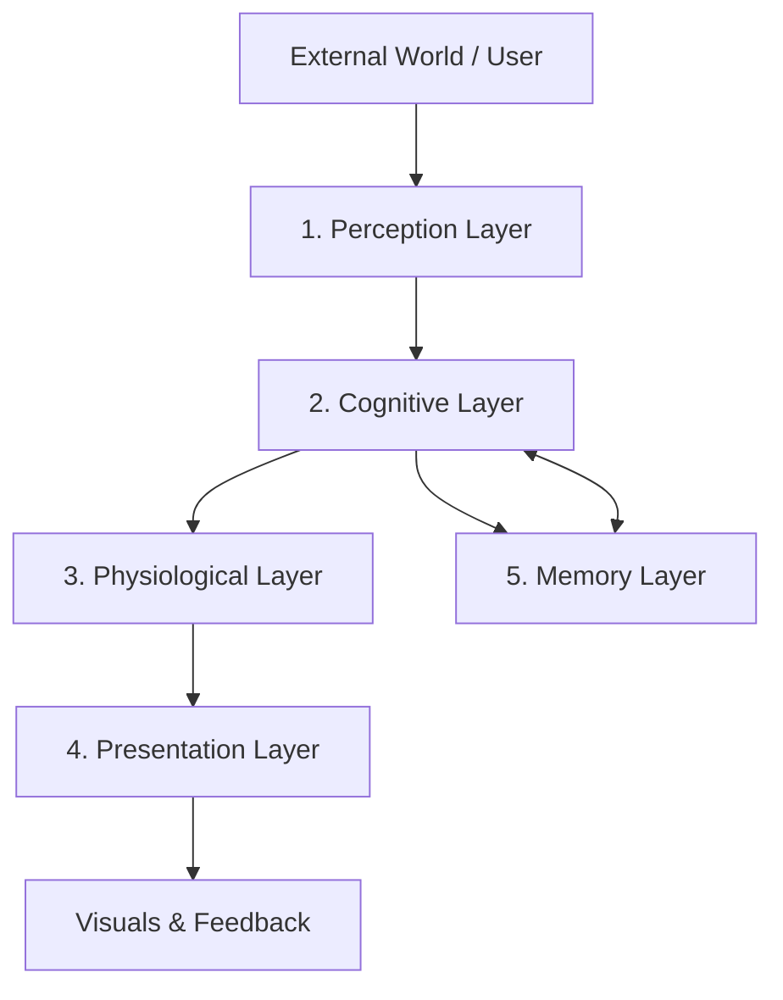

# Project Anima: High-Level System Architecture (宏观技术架构)

> **Status**: Living Document
> **Version**: 2.0
> **Philosophy**: "Bio-Digital Organism" (数字生物体) - 基于物理渲染的情感化操作系统伴侣。

本文档定义了 Anima 的仿生学软件架构。我们视其为一个数字生命体，而非简单的桌面程序。架构设计遵循 **Local-First (本地优先)** 原则，强调**软体物理 (Soft Body Physics)** 与 **多模态感知 (Multimodal Perception)**。

---

## 1. 宏观架构设计 (The Architectural Skeleton)

我们将 Anima 的架构拆解为五大生物学层级：**感知层、认知层、生理层、表达层、记忆层**。

### 1. 感知层 (The Perception Layer / Sensory System)
*这是 Anima 的眼睛和耳朵，负责收集外界信息，但不进行深度处理。*

*   **Desktop Context Sniffer (桌面环境嗅探器)**
    *   **Window Monitor (窗口监视器)**: 实时检测当前活跃窗口的元数据（应用名称、窗口标题）。
        *   *用途*: 识别用户是在写代码 (VS Code) 还是听歌 (Spotify)，触发“场景化道具”。
    *   **Idle Detector (空闲检测器)**: 监听键盘/鼠标的系统级活跃度。
        *   *用途*: 判断用户是否离开，触发“打瞌睡”或“梦境”模式。
*   **Ingestion Gateway (投喂接口网关)**
    *   **Drag & Drop Zone**: 处理文件、文本、URL 的拖拽事件。
    *   **Clipboard Listener**: (需授权) 捕捉剪贴板内容。
    *   **Sanitizer (格式清洗器)**: 将 PDF、Word、代码文件统一清洗为纯文本，去除乱码，准备送往大脑。

### 2. 认知层 (The Cognitive Layer / The Brain)
*这是核心处理单元，负责理解输入内容，并决定“这是什么”以及“我该怎么反应”。*

*   **Neural Orchestrator (神经中枢架构)**
    *   **指令控制器 (Instruction Controller)**: LLM 不再只输出文本，而是输出结构化 JSON (Function Calls)。
    *   **Intent-to-Action Mapper (意图映射层)**: 将 LLM 的抽象意图映射为具体的物理动作指令。
        *   *流程*: Input -> LLM -> JSON `{ "action": "shudder", "dialogue": "Brr...", "physics": { "stiffness": 0.8 } }` -> Physics Engine.
*   **Semantic Analysis Engine (语义分析引擎)**
    *   **Persona Filter (人格过滤器)**: [探索中]
        *   *Goal*: 不仅仅是简单的 Prompt 工程，而是探索通过 RAG 或微调模型来实现更深度的人格一致性。
        *   *Tech*: 待定 (RAG / LoRA Fine-tuning / Context Injection)。

### 3. 生理层 (The Physiological Layer / State Machine)
*这是连接“大脑”与“身体”的桥梁，维护 Anima 的数值体系。*

*   **Attributes State Machine (数值状态机)**
    *   **显性指标**: `Intimacy` (亲密度), `Mood` (情绪), `Energy` (能量)。
    *   **隐性性格**: `Rationality` (理性), `Sensibility` (感性), `Chaos` (混沌)。
*   **Evolution Manager (进化管理器)**
    *   **Procedural Texture Evolution (纹路演化)**: 基于长期行为历史，调整 Shader 参数而非生成贴图。
        *   *Genetic Shader*: 拥有噪点密度、流速、裂纹深度等参数的复杂着色器。
        *   *Logic*: Stress -> High Crack Intensity (裂纹); Art -> Ink Flow (水墨晕染)。
    *   **Symbolic Pattern Generator (符号图案生成)**: [探索中]
        *   *Concept*: 允许 LLM 生成具有具体含义的图案（代码片段、诗歌、音符）并融合进纹理中。
        *   *Tech*: 待定 (RAG / Fine-tuning / ControlNet)。

### 4. 表达层 (The Presentation Layer / The Body)
*这是用户直接看到的界面，负责将数据可视呈现。*

*   **Physics & Rendering Engine (物理渲染引擎)**
    *   **Soft Body Simulator (软体模拟器)**: 实时计算顶点的物理受力、形变、挤压、回弹。这是实现“笨拙感”的核心。
    *   **Particle System (粒子系统)**: 处理情绪特效（生气时的烟雾、开心时的爱心、故障时的噪点）。
*   **Dynamic Props System (道具挂载系统)**
    *   根据感知层的信号（如 `Context: Coding`），动态加载 3D 模型（眼镜、铲子）并绑定到软体模型的“骨骼/挂点”上。
*   **Overlay Manager (UI 覆盖层)**
    *   绘制 2D UI 元素：对话气泡、消化卡片、菜单。
    *   **Input Interceptor**: 处理鼠标的穿透与拦截（点击 Anima 本体时拦截，点击空白处穿透给后方窗口）。

### 5. 记忆层 (The Memory Layer / Persistence)
*这是 Anima 的潜意识，确保存档和“灵魂”的连续性。*

*   **Vector Database (向量记忆库)**
    *   存储所有投喂内容的高维向量，用于 RAG (Retrieval-Augmented Generation)。
    *   *用途*: 实现跨时间跨度的对话召回（“你上次也是因为这个报错生气的”）。
*   **Relational Records (关系型记录)**
    *   存储结构化数据：历史对话日志、每日状态快照、已解锁图鉴。
*   **Asset Store (资产仓库)**
    *   文件系统存储：存放生成的“消化卡”图片、“拍立得”照片、日志文件。

---

## 2. 关键数据流转逻辑 (Core Data Flows)

### 链路 A：投喂与消化 (The Feeding Loop)
1.  **User**: 拖拽一个 `error.log` 文件给 Anima。
2.  **Perception**: 识别文件类型 -> 清洗并提取文本内容。
3.  **Cognitive**: LLM 分析内容 -> 判定为“负面/技术类” -> 生成吐槽文案“又是 Null Pointer？”。
4.  **Physiological**: `Rationality +1` (理性增加), `Mood -0.1` (心情变差), `Energy +5` (饱腹感)。
5.  **Presentation**:
    *   *Physics*: 触发“吞咽”形变动画。
    *   *Particles*: 喷出一点点灰色的代码碎片（打嗝）。
    *   *UI*: 弹出“消化卡”展示吐槽文案。
6.  **Memory**: 将 `error.log` 的摘要存入向量库。

### 链路 B：被动陪伴与道具切换 (The Context Loop)
1.  **Perception**: 监视到前台窗口从 `Spotify` 切换到了 `Terminal`。
2.  **Cognitive**: 判断上下文变化：`Entertainment` -> `Work/Coding`。
3.  **Presentation**:
    *   *Props*: 卸载“耳机”模型，加载“安全帽”和“铲子”模型。
    *   *Animation*: 从“摇摆动作”切换为“挖掘动作”。

---

## 3. 技术选型映射 (Stack Mapping)

| 层级 | 核心技术 | 备注 |
| :--- | :--- | :--- |
| **感知层** | Rust (Tauri API) | 利用系统底层 API 进行高效监控。 |
| **认知层** | OpenAI API / Local LLM | 负责理解与生成。 |
| **生理层** | Rust / TypeScript | 状态机逻辑，需保证高性能与持久化。 |
| **表达层** | Three.js + Cannon.js | 软体物理与 3D 渲染。 |
| **记忆层** | Qdrant + SQLite | 向量检索与关系存储。 |
